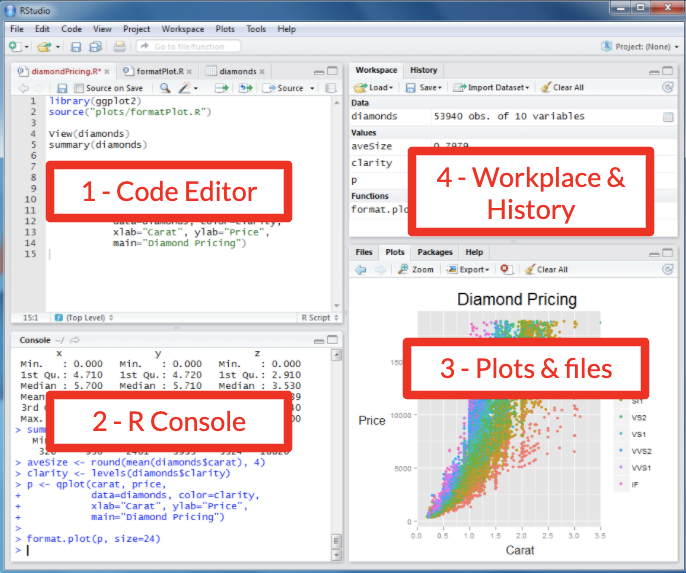
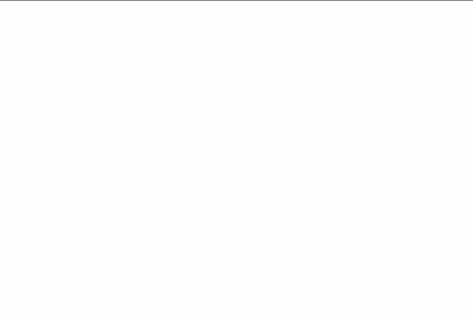
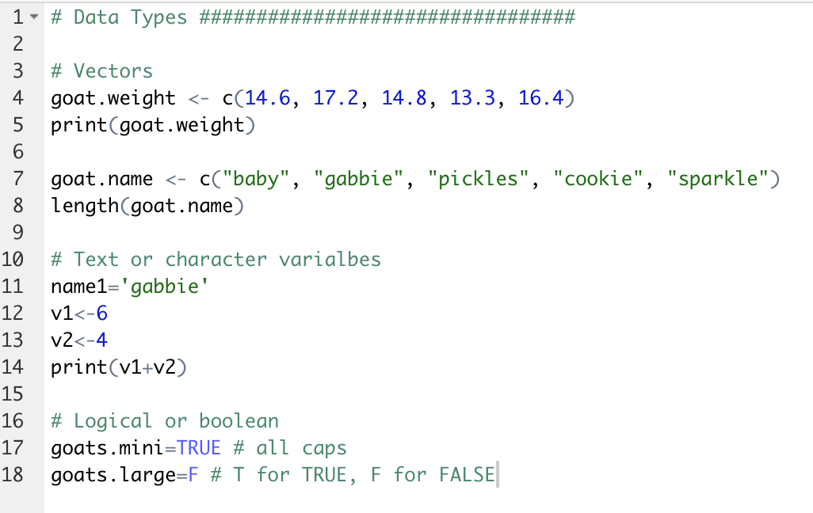
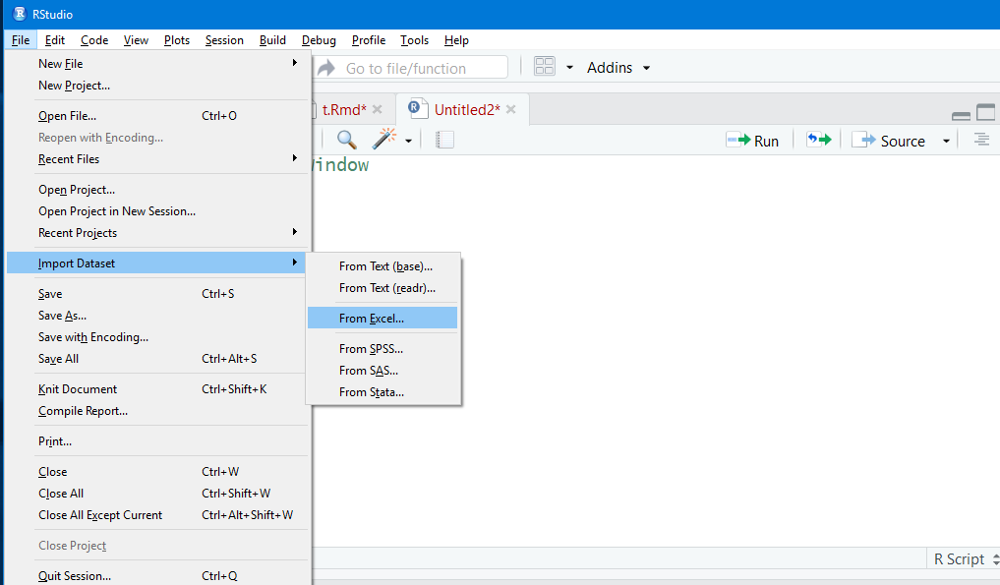
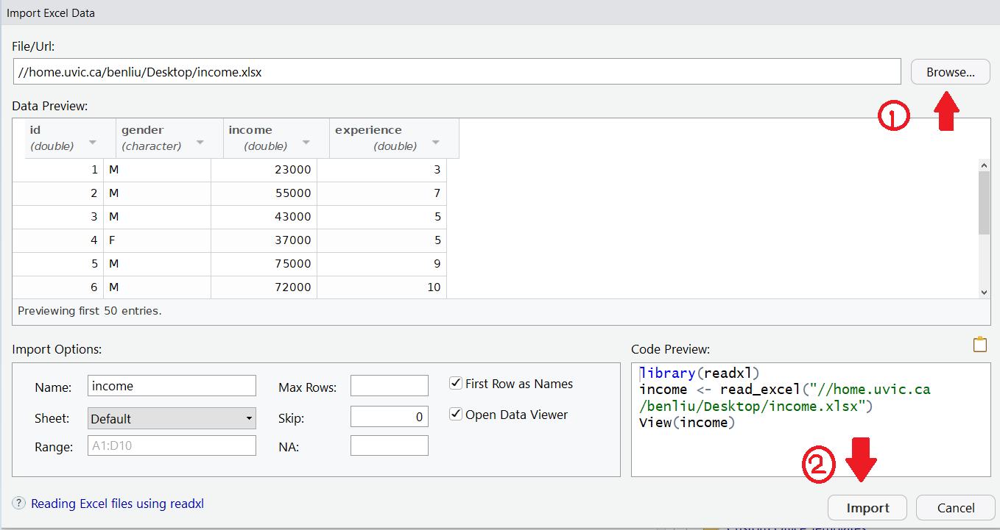

```{r setup, include=FALSE}
knitr::opts_chunk$set(echo = TRUE)
#uncomment the install.packages if you haven't installed and loaded the 'readxl' package
#install.packages("readxl")
library(readxl)
```

## 1. Getting familiar with the RStudio Interface



The RStudio interface is divided into several key areas, each serving a specific purpose. One of the great features of RStudio is that you can customize the layout by reorganizing these windows to suit your workflow.

*Hint:* You can rearrange these windows and tabs to fit your personal preference by dragging them around the workspace.<!--chloe make a video on rearranging windows and resetting--> When you rearrange the panes in RStudio on your computer, the layout stays as you set it across future sessions.

*Main components of the RStudio interface:*

1.  *Code Editor:* This is where you write and edit your R scripts. It features syntax highlighting, code completion, and other helpful tools to make coding easier.

2.  *Console:* The console is where R code is executed. You can type commands directly into the console, and it displays outputs, messages, and errors. You might prefer to use the console for immediate execution, or testing of small code snippets or commands.

3.  *Files/Plots/Packages/Help Pane:*

    -   *Files:* Browse, open, and manage files in your working directory.

    -   *Plots:* View graphical outputs from your R code, such as plots and graphs.

    -   *Packages:* Install, update, and load R packages.

    -   *Help:* Access R documentation and help files for functions and packages, and to get example code, information about datasets built in to R, and information about other general R-related topics.

4.  \- *Environment/History Pane:*

    -   *Environment:* Shows your current workspace, including defined variables, data frames, and function objects.

    -   *History:* Records all the commands you've run in the current and previous sessions.

<br>

[Task 1.1:]{.underline} Open RStudio and get familiar with the interface by identifying the 4 windows and switching between the tabs.

*Note:* This task is just for you to get comfortable. There is no solution for this task. <br>

### Working in the Code Editor

Use the code editor if you want to develop more complex, reusable, and maintainable code that can be saved and executed later. We won't be working in the code editor at this level. It will be introduced at the beginning of the Intermediate level workshop. <br>

### Working in the Console

The console is a lot like working in Terminal (mac) or Command Prompt/PowerShell (PC). Each new command line begins with the angle bracket `>` also known as the ‘prompt’ symbol. <br>

You will type the commands into the Console after the most recent angle bracket `>` also known as the ‘prompt’ symbol. When you are ready to execute ('run') the command, type ‘enter’ or ‘return’ key on your keyboard. The output to the command will appear below your command.

*Things to be mindful of:*

-   You cannot execute a command until the previous command has been completely executed.

-   If you don't see the prompt symbol, one of two things is happening:

    -   R is still processing your previous command, and you must wait for it to finish.

    -   You might instead see the plus `+` symbol, which indicates that you have entered an incomplete command.

-   If you see the `+` symbol, you must enter the remainder of the command before entering a new one. However, an error will occur if you write the `+` symbol into your command.

-   Sometimes the output can be extensive and show more information than you expected, for example, when you load in a package (we will discuss packages more in Activity 3). <br>

For all tasks in this workshop, enter your commands in the Console (bottom left).<br>

<br>

[Task 1.2:]{.underline} Try getting help! To do this, you'll run the `help()` function. Try getting information on vectors.

<br>

<details>

<summary>Show Example</summary>

```{r}
#Get additional information about "vectors" (a data type), 
help("vector") # then type 'enter' or 'return'
```

<br> `help("vector")` will provide you with information about the mean function in RStudio. The help information will be displayed in the Console following your command.

<br>

<button onclick="toggle(&#39;gif1&#39;)">

Show/Hide Animation

</button>

::: {#gif1}
 <br>
:::

</details>
<br>
*Note:* You can get help on related content by selecting the dropdown list at the top of the Help tab. <!--screenshot-->
<br>
---

------------------------------------------------------------------------

As you work through these activities, remember to save your workspace.
- Save your workspace by clicking on the top menu bar:
- File
- Save

------------------------------------------------------------------------

<br>
<br>
## 2. Creating and Manipulating Vectors and Basic Variables

<!--add infographic about the trajectory of this section (broad to narrow)-->

*Note:* For the purposes of this workshop, 'variable' and 'data object' are used interchangeably.

To create any data object, the command will begin with the a name for the new variable, followed by an assignment operator `<-`, and then the data or expression that defines the content of the variable. This can include direct values, function calls, operations, or other variables. <br>

**Definition - "Function":** A set of instructions defined to perform a specific task.

**Definition - "Function Call":** The act of executing a function with specific arguments, if required, to produce a result. <br>
<br>

### 2.1 Vectors

A vector is a 1-dimensional list of items that are of the same data type (all text, all whole numbers, etc.)

To create a vector object, you will use the `c()` function. <br>

-   The 'c' stands for 'combine' or 'concatenate.' It's used to create a vector by grouping individual values into a list-like structure.

    -   Think of it as placing items into a container where each item remains distinct and can be individually accessed.

        -   For example, `vector1 <- c(val1, val2)` creates a vector named 'vector1' containing the elements 'val1' and 'val2' as separate items in a sequence, not as a single merged item.

    -   A value in a vector can be accessed by using square brackets and its index (the value's place in the vector), where **1** is the first index.

        -   `vector1[1]` will output: 'val1'

    *Note:* We will use the term 'concatenate' later to merge strings. These have different meanings

<br>

As you might have seen if you tested the help() function by looking up information on vectors, you will know that <!--check its output--> many functions and operations in R are designed to work naturally with vectors.

<br>

[Task 2.1.1:]{.underline} Make a vector for the following weight values of miniature goats. Name your variable 'goat.weight'

| `Goat weights: 14.6, 17.2, 14.8, 13.3, 16.4`

<details>

<summary>Show Code</summary>

```{r}
# The period between 'goat' and 'weight' has no special purpose. 
# It only shows the person reading the code that 'weight' is information that pertains to 'goat' 
goat.weight <- c(14.6, 17.2, 14.8, 13.3, 16.4)
```

</details>

<br>

The command you just ran has now appeared in your console (bottom left window), and the goat.weight vector is now listed in the Environment tab (top right window) under [Values]{.underline}.<br>



If at any point you want to view the value of a variable or data associated with a data object, simply enter the variable name and type 'enter' or 'return' to execute.

<br>

[Task 2.1.2:]{.underline} Display (aka 'print') the contents of the vector containing the goat weights.

<details>

<summary>Show Code</summary>

```{r}
goat.weight
```

</details>

<br>

[Task 2.1.3:]{.underline} Display the weight of the second goat in the vector.

<details>

<summary>Show Code</summary>

```{r}
goat.weight[2]
```

</details>

*Hint:* *`data_object_name`*`[index]`

<br>

You have just worked with numeric vectors. Now let's move to string vectors.

<br> [Task 2.1.4:]{.underline} Make a vector for the following name values of miniature goats. Name your variable 'goat.name'

`Goat names: baby, gabbie, pickles, cookie, sparkle`

*Note:* Text values must be wrapped in quotations. You can use double or single quotes, but must be consistent - Good: "text" - Good: 'text' - Bad: 'text"

<details>

<summary>Show Code</summary>

```{r}
goat.name <- c("baby", "gabbie", "pickles", "cookie", "sparkle")
```

</details>

<br>

To get the length of a vector, we can use the <code>length()</code> function.

<br>

[Task 2.1.5:]{.underline} Print (display) the length of the vector of miniature goat names.

*Note:* In a script (code editor), you often need to use the print() function explicitly to see the output, especially when running multiple lines of code or within functions. However, in the console, R automatically displays the output of expressions upon execution of the command.

<details>

<summary>Show Code</summary>

```{r}
length(goat.name)
```

</details>

<br>

#### (Additional Information) Lists

A 'list' can hold items of different types (even vectors), while items in a 'vector' must all be the same type. <br>

To make a list, we'll use the `list()` function. \> *Hint:* Remember that all items in a vector must be the same type, but can be different types if in a list.

*Additional:* If you want to create 2D lists, also known as a table, you will create a matrix using the `matrix()` function. For more on matrices, [check me out](https://www.w3schools.com/r/r_matrices.asp){:target="\_blank"} Instead of creating our own matrices, we will be importing data later on.

------------------------------------------------------------------------

Reminder! Save your work

------------------------------------------------------------------------

### 2.2 Variables and Basic Data Types

We have just looked at vectors, which contain variables of the same type. Now we'll look at different types of variables.

<br>

**Definition "Basic Data Types":** Types of data representing the simplest forms of data.

**Basic Data Types**:

-   *Numeric*: Decimal or floating-point numbers (e.g., 4.5, -3.2).
-   *Integer*: Whole numbers (e.g., 1, -5, 20).
    -   In R, integers are often just treated as numeric unless explicitly specified.
-   *Character*: Text or strings (e.g., "hello", "1234").
-   *Logical*: Boolean values, either TRUE or FALSE.
-   *Factor*: Categorical data, or data as levels (e.g., "low", "medium", "high").

<br> Here we'll look at basic operations with character variables.

<br>

[Task 2.2.1:]{.underline} Create a variable for a pig's first name. 
| `The first pig's first name is 'Bart'.`

<details>

<summary>Show Code</summary>

```{r}
#assign the first name 'Bart' to the first pig (pig1)
pig1.first_name <- "Bart"
```

</details>

<br>

[Task 2.2.2:]{.underline} Create a variable for a Bart's last name. 
| `Bart's last name is 'Smith'.`

<details>

<summary>Show Code</summary>

```{r}
#assign the last name 'Smith' to the first pig (pig1)
pig1.last_name <- "Smith"
```

</details>

<br>

[Task 2.2.3:]{.underline}

Create a variable that equals Bart's first and last name, then display the full name in the console <br>

<details>

<summary>Show Code</summary>

```{r}
#concatenate the first pig's (pig1) first ('Bart') and last name ('Smith')
pig1.full_name <- paste(pig1.first_name, pig1.last_name)

#after pig1.full_name has been created, print (display) Bart's full name...
pig1.full_name
```

</details>

*Hint:* To combine two strings separated by a space, use the `paste()` function.

<br>

Now we'll look at basic operations with **numeric and integer variables**. 
First we'll create height information for Bart and find out how much he's grown in height.

<br>

[Task 2.2.4:]{.underline} Create a variable for Bart's height as a piglet.
| Bart's piglet height: 10

<details>

<summary>Show Code</summary>

```{r}
#Assign the value of Bart's piglet height
pig1.heightA <- 10
```

</details>

<br>

[Task 2.2.5:]{.underline} Create a variable for Bart's height now.
| Bart's adult height: 13.5

<details>

<summary>Show Code</summary>

```{r}
#Assign the value of Bart's current height
pig1.heightB <- 13.5
```

</details>

<br>

[Task 2.2.6:]{.underline}

Now create a variable expressing the amount he's grown.

<details>

<summary>Show Code</summary>

```{r}
# Find the difference in height using the expression: 'heightB - heightA' 
# using the subtraction operator. 
pig1.heightGain <- pig1.heightB - pig1.heightA

#after pig1.heightGain has been created, print (display) the value of pig.heightGain...

pig1.heightGain
```

</details>
*Hint:* "Expressing" indicates that the value will require an expression, in this case, a mathematical operation.

<br>
<details><summary>Expand for information about numeric variables and functions</summary>


`pig1.heightA` is an 'integer' data type (whole number)

`pig1.heightB` is a 'numeric' data type (decmial number)

R can perform operations on different data types like getting the difference of a value.

</details>

------------------------------------------------------------------------

Reminder! Save your work

------------------------------------------------------------------------


**Additional:** To display all objects you have created, execute the 'list' function in the console: `ls()`. \> *Note:* 'l' in 'ls' is the lowercase 'L'.

**Additional:** To remove data objects from your environment, execute the 'remove' function in the console: `rm()`.

e.g., `rm(full_name)`

**Time for logical or boolean values!**

We can denote if Bart is small or large with a boolean value.

<br>

[Task 2.2.7:]{.underline} Create two variables denoting Bart's general size. The Bart can either be 'mini' or 'large'. Note that Bart is a large pig.

<details>

<summary>Show Code</summary>

```{r}
pig1.mini <- FALSE

pig1.large <- TRUE
```

</details>

*Hint:* Boolean values are either 'TRUE' or 'FALSE' (case sensitive).

<details>


<summary>Expand to view the list of Environment Variables (variables you have created in your environment)</summary>

If you have followed the code provided in the activities exactly, the Variables list in your Environment tab should look the same as that in the image below. If it doesn't match and you are unsure why, check with the instructor.

</details>

<br>

Additional: Use the ls() function to see all of the variables in our environment so far.

<details>

<summary>Show Code</summary>

```{r}
ls()
```

</details>

<br>

## 3. Descriptive Statistics

Statistics is the science of collecting, analyzing, interpreting, and presenting data to uncover patterns and trends, and to make informed decisions based on this data.

If you're unfamiliar with statistics, you can learn more about it from the [w3school Statistics Tutorial](https://www.w3schools.com/statistics/index.php){:target="\_blank"}

In this section, we'll be focusing on - Basic statistical measures - Presenting data in a histogram - More on presenting data will be covered in [Activity 4-Data Visualization](https://uviclibraries.github.io/rstudio/ggplot2-data.html){:target="\_blank"} - Importing data

### 3.1 Basic statistical measures

The function names for the following three statistical measures (mean, median, standard deviation) are quite intutive. It is just the name or abbreviation of the measure, where the argument is the object containing the set of values we are analyzing. Each function takes the vector as its argument.

These three functions are designed for sets of numerical and decimal values. If run on other types (text, boolean), result will be `NA`.

For this task, we will use a new vector object containing weights for a set of pigs.

[Task 3.1.1:]{.underline}

Create a vector object with the weights of a set of pigs. Name your variable 'pigs.weight'

`Weights of pigs: 22, 27, 19, 25, 12, 22, 18`

<details>

<summary>Show Code</summary>

```{r}
pigs.weight <- c(22, 27, 19, 25, 12, 22, 18)
```

</details>

<br>

**Mean:** the average value in a set.

This function calculates the sum of the in the set and divides the sum by the number of items in the set. `mean()`

<br>

[Task 3.1.2:]{.underline} Write and execute a command that outputs the mean value of the pigs' weights

<details>

<summary>Show Code</summary>

```{r}
mean(pigs.weight)
```

</details>

This output is the average weight of all of the pigs

<br>

**Median:** The middle value in a sorted set (e.g. lowest - highest). `median()`

<br> [Task 3.1.3:]{.underline}

Write and execute a command that outputs the median value of the pigs' weights

<details>

<summary>Show Code</summary>

```{r}
median(pigs.weight)
```

</details>
<br>
The output tells you the weight of the pig that falls between the lighter half and the heavier half of the pigs. <br>

**Standard deviation:** Describes how spread out the data is. `sd()`

<br> [Task 3.1.4:]{.underline}

Write and execute a command that outputs the standard deviation of the pigs' weights

<details>

<summary>Show Code</summary>

```{r}

sd(pigs.weight)

```

</details>

The output tells you how much the weights of the pigs vary from the average weight. - A small standard deviation means that most pigs' weights are close to the average, indicating uniformity in size. - A large standard deviation suggests a wide range of weights. <br>

<br>
We can also execute a **'summary'** of our vector objects of the pigs' weights to generate several descriptive statistics at the same time.

`summary()`

<br> [Task 3.1.5:]{.underline}

Display a summary of values pertaining to the pigs' weights

<details>

<summary>Show Code</summary>

```{r}
summary(pigs.weight)
```

</details>

<br>

### 3.2. Histogram Plot for Pig Weights

**Histogram:** A graph used for understanding and analysing the distribution of values in a vector.

`hist()`

A histogram illustrates: - Where data points tend to cluster - The variability of data - The shape of variability

<br>

[Task 3.2.1:]{.underline}

Create a histogram for the pigs' weights.

<details>

<summary>Show Code and Histogram</summary>

```{r}
hist(pigs.weight)

# The histogram will appear in the Plot tab.
```

</details>

<br>

The histogram will appear in the Plots tab (bottom right quadrant if you haven't modified your RStudio layout).

We can also pass in additional parameters to control the way our plot looks.

Some of the frequently used parameters are:

-   `main` : The title of the plot

    -   e.g., `main = "This is the Plot Title"`
<br>
-   `xlab` : The x-axis label

    -   e.g., `xlab = "The X Label"`
<br>
-   `ylab` : The y-axis label

    -   e.g., ylab = "The Y Label"

<br>

[Task 3.2.2:]{.underline}

Create a histogram for the pigs' weights, with axes labels.

-   X-label: "Weight"
-   Y-label: "Frequency"
    -   This is a default value.
    -   You don't have to specify it unless you would like a different label.
-   Graph title: "Histogram of Pigs' Weights"

*Hint:* Remember, a parameter is information that goes in the parenthesis of the function.

Single parameter: `function_name(parameters)`

Multiple parameters: `function_name(parameter1, parameter2)`

<details>

<summary>Show Code and Histogram</summary>

```{r}
# The first parameter is the name of the data (vector) object
# 'main' is the graph title 
# 'xlab' is the label of the x-axis
# label parameters can be in any order, but following the data object

hist(pigs.weight,main='Histogram of Pig Weight',xlab='Weight')

# The histogram will appear in the Plot tab.
```

</details>

<br>

Additional: Use the ls() function to see all of the variables in our environment so far.

<details>

<summary>Show Code</summary>

```{r}
ls()
```

</details>

<br>

## 4. Importing Data

So far, we've create our own objects by manually entering all of the data in the console. In this section, we'll learn how to create objects by importing (aka 'reading') data (compiled outside of R) into R and visualise it with a histogram.

### 4.1 Importing Excel data into R

R can handle multiple file types:

-   .csv (comma separated values)
-   excel (.xls, .xlsx)
-   .txt (and .tsv - tab separated values)
-   .json (used for nested data structures)
    -   These would likely be arrays of more than 2 dimensions.
-   SPSS (another specialized statistics software)
-   Data scraped from the web or via an API.

We can import data multiple ways. You'll import here through "File" in the main menu. We'll look at other ways in the following activity pages.

[Task 4.1.1]{.underline}

Download and save [this Excel spreadsheet of Income data](docs/income.xlsx){:target="\_blank"} - *Note: Please remember where the income.xlsx file is saved (usually in a “downloads” or “desktop” folder).*


[Task 4.1.3:]{.underline} Import Import the dataset of Income data

-   From the top menu bar, select...

    -   File

    -   Import dataset

    -   From Excel

-   In the 'Import Excel Data' window select your file by:

    -   Entering the file path to the income.xlsx file you just downloaded.

    -   Selecting "Browse" on the right side of the path bar and locating it in the browser.

    -   Under 'Import Options,' make sure 'Name' is the same text as you wish for the variable to be named. Ours will be 'income'.

    -   Click "Import"

-   ?? In **Yes** to install the “**readxl**” package.

*Note:* Don't worry about making a mistake importing this data. You can always remove it using the `rm()` function.

 


<!-- remove summary command from screenshot-->

What you just imported is now stored as a 'data frame' object whose name is `income`.

**Definition - Data frame:** essentially a table. It is 2-dimensional object that can hold different types of data types.

*Additional:* Data frames contain information about a set of objects (e.g., cats).

-   The data frame will contain one or more columns and one or more rows.

-   One column contains related values (column 1 = age, column 2 = eye color).

    -   Because the column contains the same type of information, it is equivalent to a vector. I.e., the 'eye color' column will contain characters, not numbers.

-   One row denotes one object from the set. In a data frame of information about a set of cats, each row is information about one specific cats.

    -   A row can contain many different bits of information, like age (numerical), eye color (character), breed (character), whether or not it's spayed/neutered (boolean). Because rows may contain values of different types, one row would most likely not be a vector. It would likely be a list, which can contain values of different types.

```{r  load-data, echo=FALSE, results='hide'}
income <- read_excel("/Users/chloe/Documents/UVic/DSC/DSC Workshops- My Assignments/R Studio/income.xlsx")
```

To see the data in our data frame, simply enter the name of the data frame in the console and type 'enter' or 'return'.

<details>

<summary>Show code</summary>

```{r eval=FALSE}
income
```

</details>

<br>

The following will be the output:

```{r echo=FALSE}
income
```

*Note:* We will explore other ways to view and preview content of our data frames in Activity 3.

*Note:* `<char>` stands for "character" data type and `<dbl>` stands for "double-precision floating point numbers data" type. <br>

We can see now that our data frame `income` contains 10 objects (rows), and 4 variables (columns) - It can be inferred that this data relates to 10 people - The values with each person are: - id (in lieu of a name) (dbl) - gender (char) - income (dbl) - experience (dbl)

<ins>Task 4.1.3:</ins>

Display a summary of statistics for the `income` data.

<details>

<summary>Show Code</summary>

```{r}
summary(income)
```

</details>

<br>

### 4.2 Visualize Income with a Histogram plot

In 3.2 we made a histogram to visualize the distribution of the pig weights. Remember that the parameter that the histogram function takes is a vector.

To extract a vector (column) from our data frame, we will pass in `_dataframeName_$_columnName_`, where the name of our data is separated by the name identifying a single set of values within that data frame.

<ins>Task 4.2.1</ins>

Display the vector of data relating to 'experience' in a histogram. - X-label: 'Experience' - Title: 'Histogram of Experience' <br>

<details>

<summary>Show Code</summary>

```{r eval=FALSE}
#Remember, the generated histogram will appear in the Plot tab.
hist(income$experience, main='Histogram of Experience',xlab='Experience')
```

</details>

<br>

The following will be the output:

```{r echo=FALSE}
hist(income$experience, main='Histogram of Experience',xlab='Experience')
```

We can see in the histogram that there are 7 intervals with equally spaced breaks. In this case, the height of a cell is equal to the number of observations falling in that cell. - Why are there 7 intervals? R automatically chooses the number of intervals for you.

*Additional:* If you preferred having 4 intervals (i.e., 'bins'), use can set that using the `breaks=''` parameter.

<details>

<summary>Show code for custom number of intervals</summary>

```{r}
#breaks is equal to the number of intervals
hist(income$experience, main='Histogram of Experience',xlab='Experience', breaks=4)
```

</details>

<br>

```{=html}
<script>  

function toggle(input) {
    var x = document.getElementById(input);
    if (x.style.display === "none") {
        x.style.display = "block";
    } else {
        x.style.display = "none";
    }
}
</script>
```
```{=html}
<style>
   details {
    background-color: lightgray; 
    padding: 10px;
    margin: 5px;
    border-radius: 5px;
}
</style>
```
